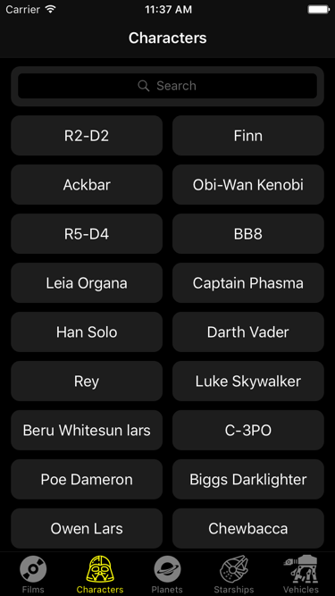

# Star Wars Lexicon
(English translation planned)
### 目的
下記リンク先のStar Wars APIと連携するSwift 4のiOSアプリです。
> [SWAPI - The Star Wars API](https://swapi.co)  

### 画面キャプチャー

### ステータス
メインブランチのバージョンについては、検索や関連映画などの機能はまだバグ修正中です。また、エラー処理は一部まだ実装中です。

今後は以下のことを予定しております。
1. Core DataからRealmへの移行（併せて、単体テストを導入）
　　現在realm-migrationブランチで実装中です。
2. Singletonパターンからもう少し効率良いパータンに移行
3. ネットワーク周りをRxSwiftでリファクター
4. MVVMまたはMVVMに近いアーキテクチャーに移行

### 使用技術・特徴
* **Core Data**
Core Dataはデータ保存のために使っており、接続がない場合でもStar Wars Lexiconが利用可能です。
* **JSON parsing**
Swift 4の標準的なJSONからオブジェクトに変換する方法を活用しております。いわゆる、Codable/Decodableプロトコルを使っています。
* **Swiftの正規ネットワーキングフレームワーク**
Alamofireなど、外部フレームワークが多く存在するのですが、このプロジェクトにおいては正規の方法で十分だと判断しました。
* **Protocol delegate pattern**
* **Singleton pattern**
誤用されがちのSingleton。使うべきパターンを検討した結果、Singletonに決めました。理由はいくつかありますが、簡単に言えば、Film以外のデータはFilmの関連Person・関連Starship・関連VehicleからURLを取得するので、別Manager ClassにURLデータを渡すことで、ネットワークアクセスを減らせます。

さらに、URLデータを渡す方法としては、Singletonが一番シンプルで、他の方法よりメモリ使用量が少ないのでは？と思いました。UITabBarのサブクラスなどでデータを渡す場合、Film以外のViewControllerを早めに初期化するため、メモリ使用量が上がるのではと思い、Singletonでは一つだけクラスを初期化することで、同じURLデータ管理の目的が果たせると思います。他の方法としては、NotificationsやProtocol delegateがありますが、同じようなメモリ使用量の弱点もあると認識しているので、Singletonを活用しております。

### 商標について
「Star Wars」の商標や画像はすべて商標登録所有者のもので、このプロジェクトは商用ではなく、あくまでも教育目的のものです。

### 本プロジェクトのライセンスについて
本プロジェクトはMITライセンスです。

### 作成者について
こちらはyhkaplanが作ったプロジェクトで、ほかにApp Storeの「Weekly Meal Manager」アプリを出しています。
> [Weekly Meal Planner（App Store）](https://itunes.apple.com/jp/app/weekly-meal-planner/id1273144461?mt=8)  

ご連絡の際はコメントにてお願い致します。
